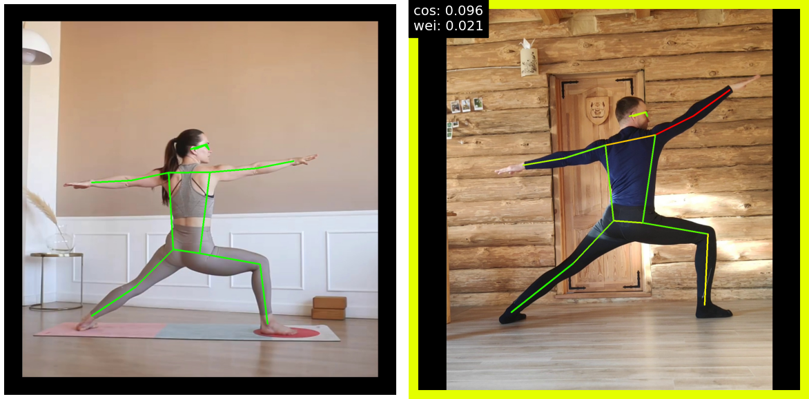

# YOGA pose quality estimation

Pose estimation, or the ability to detect humans and their poses from image data, is one of the most exciting — and most difficult — topics in machine learning and computer vision.

## Main goal
Develop Neural Network - based approach to estimate the quality of yoga-trainee pose comparing to the trainer (coach) execution as reference. This algorythm represents real interest for both: yoga trainer and trainee. Teachers can assess their students progress and correct their mistakes using visual confirmation, while yoga trainee can define how good their asanas are comparing to reference=etalon execution.

## Model
Pre-trained PyTorch KeyPoint RCNN with ResNet50 backbone.

Reference: Mask R-CNN.

The input to the model is expected to be a list of tensors, each of shape [C, H, W], one for each image, and should be in 0-1 range. Different images can have different sizes.

During inference, the model requires only the input tensors, and returns the post-processed predictions as a List[Dict[Tensor]], one for each input image. 

The fields of the Dict are as follows, where N is the number of detected instances:
* boxes (FloatTensor[N, 4]): the predicted boxes in [x1, y1, x2, y2] format, with 0 <= x1 < x2 <= W and 0 <= y1 < y2 <= H.
* labels (Int64Tensor[N]): the predicted labels for each instance
* scores (Tensor[N]): the scores or each instance
* keypoints (FloatTensor[N, K, 3]): the locations of the predicted keypoints, in [x, y, v] format.

The pretrained weights: 'COCO_LEGACY'

## Metrics

### cosine distance

    Cosine similarity is a measure of similarity between two vectors: basically, it measures the angle between them and returns -1 if they’re exactly opposite, 1 if they’re exactly the same. Importantly, it’s a measure of orientation and not magnitude.

While cosine similarity measures how similar two vectors are, cosine distance measures how different they are. 

We used cosine similarity to get a similarity measure between our incoming 34-float array and any given 34-float array in our database.

Owing to a person in input image can appear in a different subset of the image (top left, bottom right, center, etc.), some additional steps were performed to be able to compare the data consistently:
* Resize and scale: We used each person’s bounding box coordinates to crop and scale each image (and corresponding keypoint coordinates) to a consistent size.
* Normalization: We further normalized the resulting keypoints coordinates by treating them as an L2 normalized vector array.

With the normalized keypoint coordinates (stored as an array), we eventually calculated the cosine similarity and perform a few calculations detailed below to arrive at a euclidean distance that can be interpreted as a cosine distance. 

$$ D(F_{xy},G_{xy}) = \sqrt {2*(1-cosineSimilarity(F_{xy},G_{xy}))} $$

* Fxy and Gxy are two pose vectors to be compared after L2 normalization.

    *The lower the number, the closer the distance*

### weighted distance

When we are trying to infer where a joint is, we almost never have 100% confidence in where it is. Each piece of joint data returned thus also has a confidence score. Sometimes we are very confident of where a joint is (e.g., if we can see it clearly); other times, we have very low confidence (e.g., if the joint is cut off or occluded). 

We have to try to consider key points confidence levels to assess pose similarity. It can be manageable using the following approach:

$$ D(F_{xy}, G_{xy}) = {{1} \over {\sum_{k=1}^{17} Fc_k} } * {\sum_{k=1}^{17}Fc_k||Fxy_k-Gxy_k||} $$

* F and G are two pose vectors to be compared after L2 normalization. 
* Fck is the confidence score of the kth keypoint of F. 
* Fxy and Gxy represent the x and y positions of the k-th keypoint for each vector.

    *The lower the number, the closer the distance*

### Important terms

***Euclidean distance***

Euclidean distance is the shortest distance between two points in an N dimensional space also known as Euclidean space. It is used as a common metric to measure the similarity between two data points and used in various fields such as geometry, data mining, deep learning and others.

It is, also, known as Euclidean norm, Euclidean metric, L2 norm, L2 metric and Pythagorean metric.

***Data normalization***

Data normalization is used in machine learning to make model training less sensitive to the scale of features. This allows our model to converge to better weights and, in turn, leads to a more accurate model. Normalization makes the features more consistent with each other, which allows the model to predict outputs more accurately.

Some common norm calculations:

* L1-norm: 

$$ ||x||_1 = {\sum_i |x_i|} $$
* L2-norm: 

$$ ||x||_2 = \sqrt{{\sum_i |x_i|^2}} $$

***Normalizing a Vector***

For vector u $\epsilon R^n$ 

$$ ||u|| = \sqrt{u_1^2+u_2^2+...+u_n^2} $$

Mathematically a norm is a total size or length of all vectors in a vector space or matrices. And after we calculate the Norm, then we can normalize a vector. By definition a norm on a vector space—over the real or complex field—is an assignment of a non-negative real number to a vector. The norm of a vector is its length, and the length of a vector must always be positive (or zero). 

When we normalize a vector V=(x,y,z), we actually calculate 

$$ {V\over{|V|}} = ({x\over{|V|}}, {y\over{|V|}}, {z\over{|V|}}) $$

L2 Norm of a vector = Euclidian distance of that point vector from origin.

## Summary

Both metrics provide poses-similarity-dependent scores: the more reference and test images are similar, the smaller values are displayed; visualization technique takes into account the poses similarity/distance value: the lower the metrics values (higher poses similarity), the greener coloring; high distance (low poses similarity) lead to red coloring.

Video of yoga trainee pose-execution in comparison with a reference is available here: 

https://drive.google.com/file/d/11a7uKdTXzNXmnAXWYMG_hGRPH8ldDzvE/view?usp=sharing

  
## Libraries & tools used
* see the requirements
